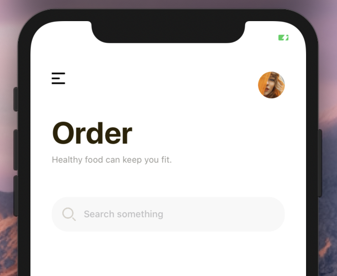
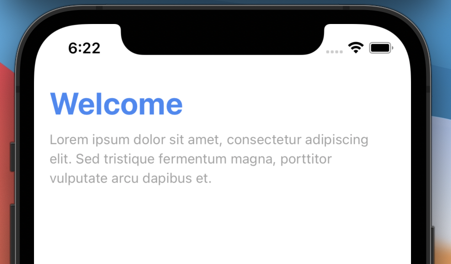
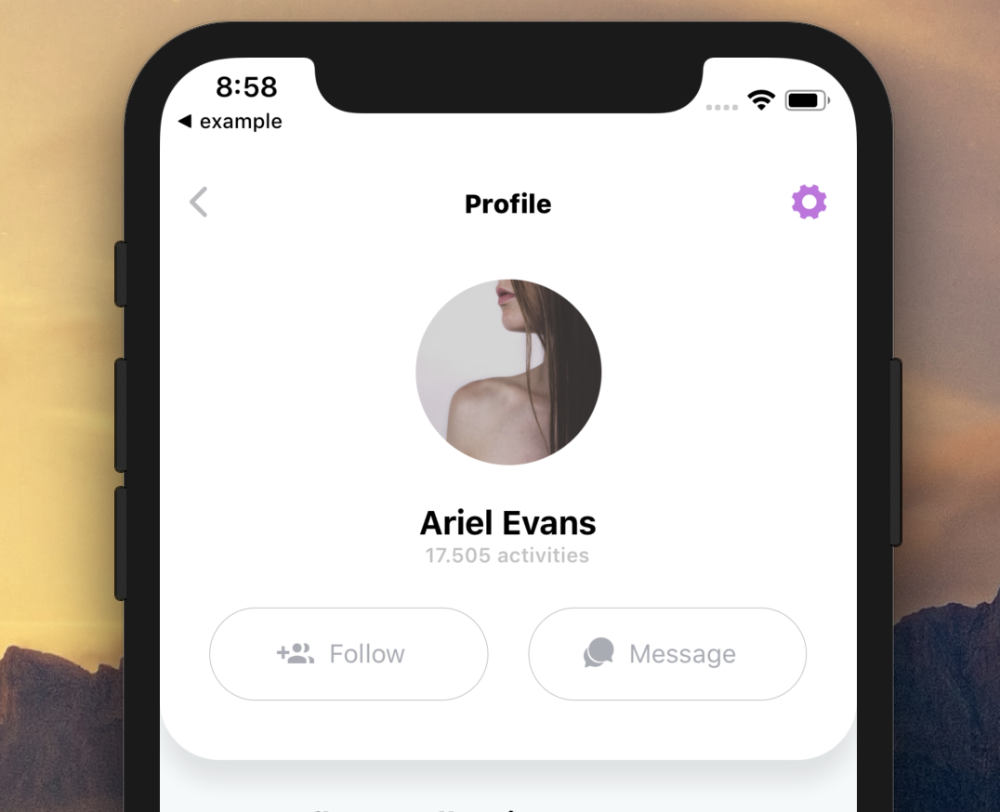
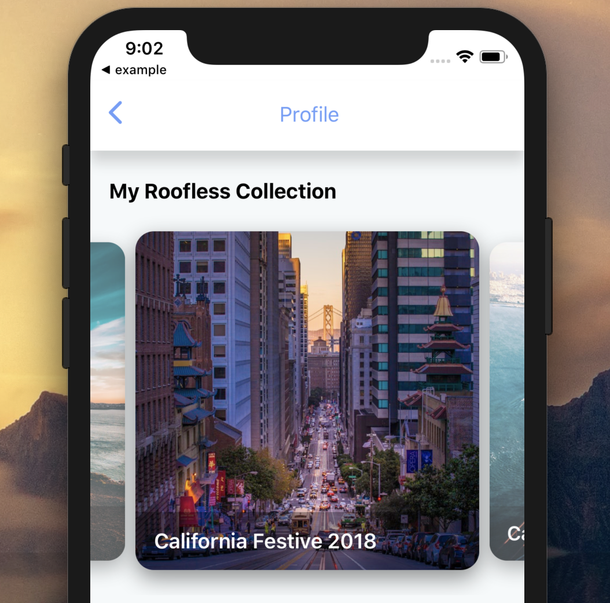

[](https://github.com/WrathChaos/react-native-button)

[](https://github.com/WrathChaos/react-native-header-view)

[](https://www.npmjs.com/package/@freakycoder/react-native-header-view)
[](https://www.npmjs.org/package/@freakycoder/react-native-header-view)

[](https://opensource.org/licenses/MIT)
[](https://github.com/prettier/prettier)

<table>
  <tr>
    <td>
      <b>Apple Header</b>
    </td>
    <td>
      <b>Gorgeous Header</b>
    </td>
  </tr>
  <tr>
    <td align="center">
      
    </td>
    <td align="center">
      
    </td>
   </tr>
  
</table>

<table>
  <tr>
    <td>
      <b>Elegant Header</b>
    </td>
    <td>
      <b>Modern Header</b>
    </td>
  </tr>
 <tr>
    <td align="center"> 
      
    </td>
    <td align="center">
      
    </td>
   </tr>
</table>

<table>
  <tr>
    <td>
      <b>Profile Header</b>
    </td>
    <td>
      <b>Classic Header</b>
    </td>
  </tr>
 <tr>
    <td align="center"> 
      
    </td>
    <td align="center">
      
    </td>
   </tr>
</table>

# Finally Version 1.0.0 🥳

Finally, this library got the version **1.0.0**. More than **5k downloads** and it is separated by each header view. This library contains the collection of each header view. If you do not need to use them all, you can reach and install header views on its own repository.

# Options

- [GorgeousHeader](https://github.com/WrathChaos/react-native-gorgeous-header)
- [AppleHeader](https://github.com/WrathChaos/react-native-apple-header)
- [ModernHeader](https://github.com/WrathChaos/react-native-modern-header)
- [ClassicHeader](https://github.com/WrathChaos/react-native-classic-header)
- [ProfileHeader](https://github.com/WrathChaos/react-native-profile-header)

## Installation

<b><i>You can use each Header View separately if you do not want to use the collection.</i></b>

Add the dependency:

### Pure React Native

```bash
npm i @freakycoder/react-native-header-view
```

## Peer Dependencies

##### IMPORTANT! You need install them.

```bash
"react-native-gorgeous-header": ">= 0.1.0",
"react-native-classic-header": ">= 0.1.0",
"react-native-modern-header": ">= 0.1.0",
"react-native-apple-header": ">= 0.1.0",
"react-native-profile-header": ">= 0.1.0",
```

# Usage

## Gorgeous Header Usage

```jsx
import { GorgeousHeader } from "@freakycoder/react-native-header-view";

<GorgeousHeader onChangeText={(text) => console.log(text)} />;
```

## Apple Header Usage

```jsx
import { AppleHeader } from "@freakycoder/react-native-header-view";

<AppleHeader />;
```

## Modern Header Usage

```jsx
import { ModernHeader } from "@freakycoder/react-native-header-view";

<ModernHeader />;
```

### Advanced Usage

```jsx
import { ModernHeader } from "@freakycoder/react-native-header-view";

<ModernHeader
  text="Profile"
  rightIconType="Ionicons"
  backgroundColor="#fdfdfd"
  rightIconName="ios-settings"
  rightIconColor={colors.light.primary}
  leftIconComponent={your - icon - component}
  rightIconComponent={your - icon - component}
  leftIconOnPress={() => NavigationService.back()}
/>;
```

## Classic Header Usage

### Basic Usage

```jsx
import { ClassicHeader } from "@freakycoder/react-native-header-view";

<ClassicHeader
  headerTitle="Header"
  rightComponentDisable
  leftComponentOnPress={() => {}}
  hitSlops={
    top: 30,
    bottom: 30,
    left: 30,
    right: 30
  }
/>
```

#### Advanced Custom Usage

```jsx
import { ClassicHeader } from "@freakycoder/react-native-header-view";

<ClassicHeader
  headerTitle="Header"
  leftComponent={
    <TouchableOpacity onPress={() => {}}>
      <Icon name="ios-arrow-back" type="Ionicons" size={30} color="blue" />
    </TouchableOpacity>
  }
  rightComponent={
    <TouchableOpacity onPress={() => {}}>
      <Icon name="github" type="AntDesign" size={30} color="purple" />
    </TouchableOpacity>
  }
/>;
```

## Profile Header Usage

```jsx
import { ProfileHeader } from "@freakycoder/react-native-header-view";

<ProfileHeader />;
```

# Configuration - Props

## Gorgeous Header Props

| Property            |   Type   |            Default             | Description                                                             |
| ------------------- | :------: | :----------------------------: | ----------------------------------------------------------------------- |
| title               |  string  |             Order              | change the title                                                        |
| subtitle            |  string  | Healthy food can keep you fit. | change the subtitle                                                     |
| searchIcon          |  asset   |            default             | set your own icon for the search one                                    |
| titleTextStyle      |  style   |            default             | set your own style for title text                                       |
| subtitleTextStyle   |  style   |            default             | set your own style for subtitle text                                    |
| searchBarStyle      |  style   |            default             | set your own style for search text input container                      |
| searchInputStyle    |  style   |            default             | set your own style for search text input                                |
| menuImageStyle      |  style   |            default             | set your own style for hamburger menu image                             |
| menuImageSource     |  asset   |            default             | set your own image instead of default hamburger menu image              |
| menuImageOnPress    | function |           undefined            | use this to set your own function for pressing the hamburger menu image |
| profileImageStyle   |  style   |            default             | set your own style for profile image                                    |
| profileImageSource  |  asset   |           undefined            | use this to set your own image for profile image                        |
| profileImageOnPress | function |           undefined            | use this to set your own function for pressing the profile image        |

## Apple Header Props

| Property             |   Type   |       Default       | Description                                                                           |
| -------------------- | :------: | :-----------------: | ------------------------------------------------------------------------------------- |
| dateTitle            |  string  | MONDAY, 27 NOVEMBER | set your own string instead of date title                                             |
| largeTitle           |  string  |       For You       | set your own large title                                                              |
| imageSource          |  image   |        image        | set your own image                                                                    |
| onPress              | function |        null         | use this to set onPress functionality                                                 |
| backgroundColor      |  color   |     transparent     | use this to change the main container's background color                              |
| borderColor          |  color   |       #EFEFF4       | use this to change the bottom border color                                            |
| dateTitleFontColor   |  color   |       #8E8E93       | use this to change the date title's font color                                        |
| dateTitleFontSize    |  number  |         13          | use this to set the date title's font size                                            |
| dateTitleFontWeight  |  string  |        "600"        | use this to set the date title's font weight                                          |
| largeTitleFontColor  |  color   |    default color    | use this to change the large title's font color                                       |
| largeTitleFontSize   |  number  |         34          | use this to set the large title's font size                                           |
| largeTitleFontWeight |  string  |       "bold"        | use this to set the large title's font weight                                         |
| dateTitleStyle       |  style   |    default style    | use this to set your own style for date title (DO NOT RECOMMENDED!)                   |
| largeTitleStyle      |  style   |    default style    | use this to set your own style for large title (DO NOT RECOMMENDED!)                  |
| containerStyle       |  style   |    default style    | use this to set your own style for whole container (DO NOT RECOMMENDED!)              |
| avatarStyle          |  style   |    default style    | use this to set your own style for avatar style (DO NOT FORGET TO ADD BORDER-RADIUS!) |

## Modern Header Props

| Property           |       Type       |    Default     | Description                                                     |
| ------------------ | :--------------: | :------------: | --------------------------------------------------------------- |
| height             | string OR number |       70       | change the height of the header                                 |
| width              | string OR number |     "100%"     | change the width of the header                                  |
| backgroundColor    |      string      |      #fff      | change the background color of the header                       |
| styles             |      styles      |     styles     | use this to change main style of the header                     |
| text               |      string      |  Header Title  | set the header's title                                          |
| textStyle          |      style       |     style      | set your own style for the header's text                        |
| left               |      number      |       16       | use this to set left icon's align                               |
| right              |      number      |       16       | use this to set right icon's align                              |
| leftIconName       |      string      | ios-arrow-back | change the left icon depends on the React Native Vector Icons   |
| leftIconType       |      string      |    Ionicons    | change the left icon's type                                     |
| leftIconSize       |      number      |       25       | change the left icon's size                                     |
| leftIconColor      |      color       |    #bbbabe     | change the left icon's color                                    |
| rightIconName      |      string      |     heart      | change the right icon depends on the React Native Vector Icons  |
| rightIconType      |      string      |     Entypo     | change the right icon's type                                    |
| rightIconSize      |      number      |       25       | change the right icon's size                                    |
| rightIconColor     |      color       |    #23c4c1     | change the right icon's color                                   |
| leftIconComponent  |    component     |      Icon      | use your own component instead of the integrated Icon component |
| rightIconComponent |    component     |      Icon      | use your own component instead of the integrated Icon component |
| leftIconOnPress    |     function     |    function    | set the function for left icon's onPress                        |
| rightIconOnPress   |     function     |    function    | set the function for right icon's onPress                       |
| leftDisable        |     boolean      |     false      | disable the left icon component                                 |
| rightDisable       |     boolean      |     false      | disable the right icon component                                |

## Classic Header Props

| Property              |   Type    |  Default   | Description                                                                  |
| --------------------- | :-------: | :--------: | ---------------------------------------------------------------------------- |
| styles                |  styles   |   styles   | use this to change main style of the header                                  |
| height                |  number   |     50     | use this to change the header's height                                       |
| width                 |  number   |    100%    | use this to change the header's width                                        |
| statusBarHidden       |  boolean  |   false    | use this to let Header Component itself re-arrange depends on the status bar |
| hitSlops              |  object   | object: 30 | use this to change the header's left and right components' hitSlots          |
| bottomStick           |  boolean  |   false    | stick the header to bottom side                                              |
| headerTitle           |  string   |     ""     | use this to set header's title                                               |
| backgroundColor       |   color   |  #ffffff   | use this to change the header's background color                             |
| leftComponent         | component |    Icon    | set the left component                                                       |
| leftComponentStyle    |   style   |   style    | set the left component's style                                               |
| leftComponentDisable  |  boolean  |   false    | disable the left component                                                   |
| leftComponentOnPress  | function  |    null    | set the left component's onPress function                                    |
| rightComponent        | component |    Icon    | set the right component                                                      |
| rightComponentStyle   |   style   |   style    | set the right component's style                                              |
| rightComponentDisable |  boolean  |   false    | disable the right component                                                  |
| rightComponentOnPress | function  |    null    | set the right component's onPress function                                   |
| centerComponent       | component |    Icon    | set the center component                                                     |
| centerComponentStyle  |   style   |   style    | set the center component's style                                             |

## ProfileHeader Props

| Property                     |   Type    |  Default  | Description                                                                             |
| ---------------------------- | :-------: | :-------: | --------------------------------------------------------------------------------------- |
| onLeftButtonPress            | function  | undefined | set the logic for left aligned button                                                   |
| onProfilePicPress            | function  | undefined | set the logic for profile picture                                                       |
| onFirstIconPress             | function  | undefined | set the logic for first icon button                                                     |
| onSecondIconPress            | function  | undefined | set the logic for second icon button                                                    |
| onThirdIconPress             | function  | undefined | set the logic for third icon button                                                     |
| profileImageSource           |   image   |  default  | change the profile image source                                                         |
| leftAlignedButtonImageSource |   image   |  default  | change the left aligned button image source                                             |
| firstIconImageSource         |   image   |  default  | change the first icon image source                                                      |
| secondIconImageSource        |   image   |  default  | change the second icon image source                                                     |
| thirdIconImageSource         |   image   |  default  | change the third icon image source                                                      |
| titleText                    |  string   | undefined | change the title text                                                                   |
| height                       |  number   |    50     | change the profile header's height                                                      |
| backgroundColor              |   color   |   #fff    | change the profile header's background color                                            |
| leftButtonComponent          | component |   Image   | set your own component instead of default left aligned Button Image                     |
| disableFirstIcon             |  boolean  |   false   | disable the first icon                                                                  |
| disableSecondIcon            |  boolean  |   false   | disable the second icon                                                                 |
| disableThirdIcon             |  boolean  |   false   | disable the third icon                                                                  |
| disableLeftAlignedButton     |  boolean  |   false   | disable the left aligned icon                                                           |
| ImageComponent               | component |   Image   | set your own Image component instead of default react native Image such as; `FastImage` |

# Change Log

## [0.4.13](https://github.com/WrathChaos/react-native-header-view/tree/0.4.13) (2019-11-22)

[Full Changelog](https://github.com/WrathChaos/react-native-header-view/compare/0.4.11...0.4.13)

## [0.4.11](https://github.com/WrathChaos/react-native-header-view/tree/0.4.11) (2019-11-13)

[Full Changelog](https://github.com/WrathChaos/react-native-header-view/compare/0.4.10...0.4.11)

## [0.4.10](https://github.com/WrathChaos/react-native-header-view/tree/0.4.10) (2019-11-13)

[Full Changelog](https://github.com/WrathChaos/react-native-header-view/compare/0.4.7...0.4.10)

**Implemented enhancements:**

- Apple header Bg colour options [\#6](https://github.com/WrathChaos/react-native-header-view/issues/6)

## [0.4.7](https://github.com/WrathChaos/react-native-header-view/tree/0.4.7) (2019-10-04)

[Full Changelog](https://github.com/WrathChaos/react-native-header-view/compare/0.4.6...0.4.7)

## [0.4.6](https://github.com/WrathChaos/react-native-header-view/tree/0.4.6) (2019-10-04)

[Full Changelog](https://github.com/WrathChaos/react-native-header-view/compare/0.4.5...0.4.6)

**Closed issues:**

- Request to Add product in Start React [\#5](https://github.com/WrathChaos/react-native-header-view/issues/5)

**Merged pull requests:**

- Bump eslint-utils from 1.4.0 to 1.4.2 in /example [\#4](https://github.com/WrathChaos/react-native-header-view/pull/4) ([dependabot[bot]](https://github.com/apps/dependabot))

## [0.4.5](https://github.com/WrathChaos/react-native-header-view/tree/0.4.5) (2019-08-17)

[Full Changelog](https://github.com/WrathChaos/react-native-header-view/compare/0.3.0...0.4.5)

## [0.3.0](https://github.com/WrathChaos/react-native-header-view/tree/0.3.0) (2019-08-12)

[Full Changelog](https://github.com/WrathChaos/react-native-header-view/compare/0.2.61...0.3.0)

**Merged pull requests:**

- Bump lodash from 4.17.11 to 4.17.14 in /examples [\#3](https://github.com/WrathChaos/react-native-header-view/pull/3) ([dependabot[bot]](https://github.com/apps/dependabot))
- Bump handlebars from 4.1.0 to 4.1.2 in /examples [\#2](https://github.com/WrathChaos/react-native-header-view/pull/2) ([dependabot[bot]](https://github.com/apps/dependabot))
- Bump js-yaml from 3.12.1 to 3.13.1 in /examples [\#1](https://github.com/WrathChaos/react-native-header-view/pull/1) ([dependabot[bot]](https://github.com/apps/dependabot))

## [0.2.61](https://github.com/WrathChaos/react-native-header-view/tree/0.2.61) (2019-03-19)

[Full Changelog](https://github.com/WrathChaos/react-native-header-view/compare/0.2.6...0.2.61)

## [0.2.6](https://github.com/WrathChaos/react-native-header-view/tree/0.2.6) (2019-03-05)

[Full Changelog](https://github.com/WrathChaos/react-native-header-view/compare/0.2.5...0.2.6)

## [0.2.5](https://github.com/WrathChaos/react-native-header-view/tree/0.2.5) (2019-03-05)

[Full Changelog](https://github.com/WrathChaos/react-native-header-view/compare/0.2.4...0.2.5)

## [0.2.4](https://github.com/WrathChaos/react-native-header-view/tree/0.2.4) (2019-03-05)

[Full Changelog](https://github.com/WrathChaos/react-native-header-view/compare/0.2.3...0.2.4)

## [0.2.3](https://github.com/WrathChaos/react-native-header-view/tree/0.2.3) (2019-03-05)

[Full Changelog](https://github.com/WrathChaos/react-native-header-view/compare/0.2.2...0.2.3)

## [0.2.2](https://github.com/WrathChaos/react-native-header-view/tree/0.2.2) (2019-03-05)

[Full Changelog](https://github.com/WrathChaos/react-native-header-view/compare/0.2.0...0.2.2)

## [0.2.0](https://github.com/WrathChaos/react-native-header-view/tree/0.2.0) (2019-02-23)

\* _This Change Log was automatically generated by [github_changelog_generator](https://github.com/skywinder/Github-Changelog-Generator)_

## Credits

Photo by [Joanna Nix](https://unsplash.com/@joanna_nix?utm_source=unsplash&utm_medium=referral&utm_content=creditCopyText) on [Unsplash](https://unsplash.com/photos/9Zso3BvhuCk)

## Author

FreakyCoder, kurayogun@gmail.com

## License

React Native Header View Library is available under the MIT license. See the LICENSE file for more info.
